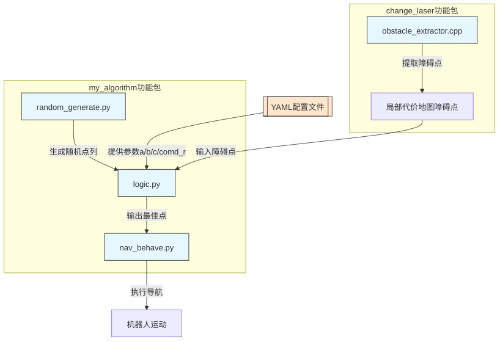

<div align="center" style="font-size: 55px; font-weight: 800;">
  2025ROBOCON飞身上篮导航逻辑功能实现
</div>

## 维护者
- nagisa 
- QQ：2964793117

# 文件解释
- 该算法源文件存在于[该仓库](https://github.com/njustup70/visual_2025/tree/dev2.5/src)下

- 其中[my_algorithm](https://github.com/njustup70/visual_2025/tree/dev2.5/src/my_algorithm) 功能包存在有随机点生成策略（random_generate.py）,逻辑选点策略（logic.py）与导航执行策略部分（nav_behave.py）

- 在[change_laser](https://github.com/njustup70/visual_2025/tree/dev2.5/src/change_laser)功能包的obstacle_extractor.cpp存在有利用代价地图，提取密集障碍点的策略部分。

- 注意：~~laser_change.cpp已弃用~~

# 算法逻辑解释
## 文字解释
- 本算法利用obstacle_extractor.cpp提取当前导航的<u>局部代价地图(local_costmap)</u>的障碍层+膨胀层部分作为障碍点;使用random_generate.py生成随机点列（其中有若干限制和参数可改，后续会说），并利用logic.py来进行随机点列中的最佳点选取。

## 选取点规则：
将生成的随机点列遍历，并将每个点算出得分，取最高分数点。公式为：得分数=a*障碍评分+b*角度评分+c*半径评分。
- 障碍评分：即将生成点随机点列的每个点与当前在前述的提取所有障碍点算距离的和，距离越大，证明威胁度越小，得分越高。

- 角度评分：是假设机器人导航到的目标点与篮筐而连线与篮筐和其对边点连线（即垂直于场地长边）的垂线的角度，即投射yaw角，当前假设yaw角越小，投篮准度越高，即得分越高。

- 半径评分：即当前点与篮筐的距离，距离越靠近于[yaml文件中的comd_r参数](https://github.com/njustup70/visual_2025/blob/dev2.5/src/rc_navigation/config/nav_decide_sim.yaml)，得分越高。

- 上述的所有得分在算出后经过了归一化，之后再乘以a、b、c三个系数（可在yaml文件中修改）后相加，得到最终的得分。

## 流程图解释


# [配置文件解释:此处以仿真yaml为例子](https://github.com/njustup70/visual_2025/blob/dev2.5/src/rc_navigation/config/nav_decide_sim.yaml)（同文件目录下还存在真实世界yaml）
```yaml
/random_generate:  # RandomPointGenerator节点命名空间
  ros__parameters:
    coordinate_precision: "high" # 可选择生成的随机点精度，如果选low则与第二个参数一起使用，high高精度为小数点后若干位浮点数
    decimal_places: 1  # 低精度会使得生成点的坐标是小数点后x位，x由本参数指定
    map_x: 7.0         # 设定赛场边界，|x|的最大值，可取正取负
    map_y: -14.0       # 设定赛场边界，|y|的最大值，可取正取负，正负值代表正负方向
    center_x: 3.5      # 球筐x坐标
    center_y: -14.0    # 球筐y坐标
    origin_x: 0.0      # 起始点x坐标
    origin_y: 0.0      # 起始点y坐标
    radius_min: 3.0    # 生成随机点最小半径
    radius_max: 4.0    # 生成随机点最大半径
    num_points: 36     # 生成随机点数量
    safety_distance: 0.5  # 与地图边界的生成点安全距离，在传入的赛场范围的内区间范围内不会生成点
    publish_mode: "fixed" # 生成随机点策略，fixed为生成不变固定点，dynamic为生成变化随机点
    continuous_publish: true # 是否持续生成点，建议保留true
    publish_frequency: 2.0  # 点的发布频率（HZ）
    half_circle: true   # 是否只在半圆环生成点，建议保留true
    min_generation_interval: 0.5 # 点生成的最小时间间隔

/optimal_point_selector:  # OptimalPointSelector节点命名空间
  ros__parameters:
    center_x: 3.5  # 篮筐（圆心）x坐标
    center_y: -14.0 # 篮筐（圆心）y坐标
    refer_point_x: 3.5 # 辅助点（篮筐的对长点）x坐标
    refer_point_y: 0.0 # 辅助点（篮筐的对长点）y坐标
    comd_r: 2.5 # 指令半径（最佳投球半径）
    a: 1.0 # 障碍物评分参数
    b: 1.0 # 角度评分参数
    c: 1.0 # 半径匹配评分参数
    max_diff: 3.0 # 半径匹配最大允许半径差值，大于此差值的（实际距圆心距离-com_r最佳半径的点会被截断）

/obstacle_extractor:  # ObstacleExtractor节点命名空间
  ros__parameters:
    costmap_topic: "/local_costmap/costmap"  # 订阅的障碍地图话题
    # 划定障碍点采纳区间
    region_origin_x: 0.0  # 障碍点采纳区间原点x
    region_origin_y: 0.0  # 原点y
    region_xlength: 7.0  # 障碍点采纳区间x长度
    region_ylength: -14.0  # y长度 

/optimal_goal_navigator:  # OptimalGoalNavigator节点命名空间
  ros__parameters:
    goal_timeout: 60.0 # 导航超时时间
    max_failures: 20   # 导航最大重试次数
```
## <u>调参建议</u>
- 文件中的map_x,map_y,region_xlength,region_ylength参数均为赛场矩形的边界长度判定，其值应为赛场的实际长度，正负值代表坐标轴正负方向，正负值是均可以取的，因为原点基本均取为(0,0)，所以无论仿真还是实地，<u>_建议人为导航到原点的场地对角线点的到x,y值得到场地限制（这个值的正负与你填入参数的正负一致），一旦确定正负，其实你就确定好了x,y轴正方向_</u>。

- origin_x,origin_y,region_origin_x,region_origin_y,参数均为起始点坐标，建议均取(0,0)，即场地中心点。

- center_x,center_y参数均为篮筐坐标，建议在选取好第一条中的那几个限制赛场的参数后再做选取，<u>_同样满足你自己给的正负关系，及坐标系正向_</u>。

- refer_point_x,refer_point_y参数均为篮筐对边点坐标，即篮筐所在宽边的对边宽边的中点坐标。

- <u>_上述的所有参数如果存在有重名，需要在每个节点命名空间中多次修改，因为不会跨节点赋值（例如center_x）_</u>。

- 其余的请对照这上述注释使用。